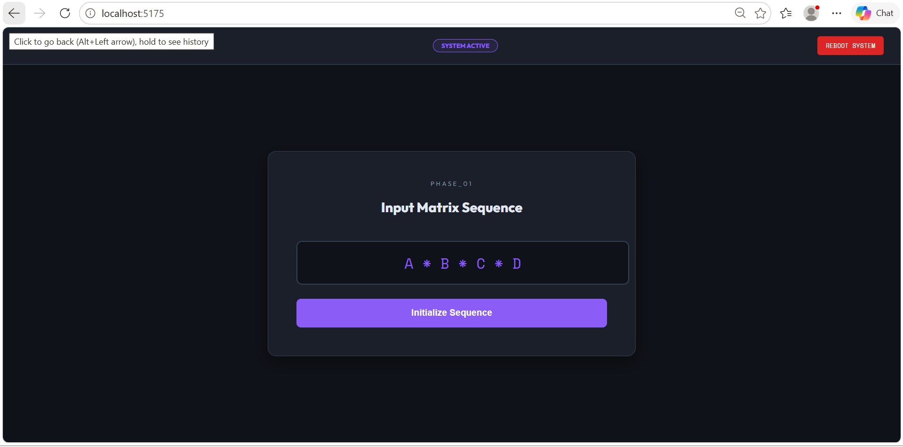
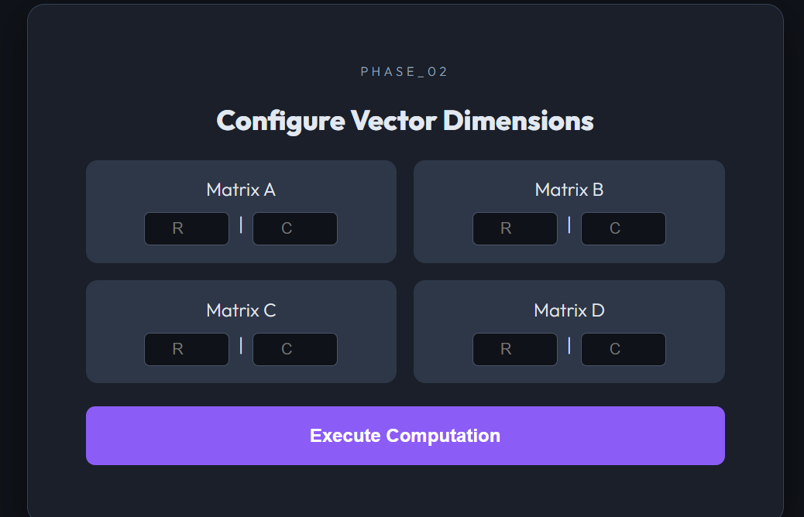

# Dynamic Programming Visualizer

An interactive and educational web application designed to help students and developers understand Dynamic Programming concepts through real-time visualization, step-by-step execution, and intuitive user interaction.

## 🎥 Project Demo

Watch the complete project demonstration on YouTube:

https://youtu.be/NJDvAV_wUmo?si=C-RliZpQu-W9WSug

---

## 📖 Overview

Dynamic Programming is one of the most important problem-solving techniques in computer science. This project provides a visual representation of Dynamic Programming concepts, helping users understand how complex problems can be optimized through memoization and efficient state transitions.

The application focuses on simplifying theoretical concepts by transforming them into interactive visual demonstrations.

---

## ✨ Features

* Dynamic Programming Visualization
* Real-Time Execution
* Interactive User Interface
* Educational Demonstrations
* Responsive Design
* Frontend & Backend Integration
* Clean and Structured Codebase
* Beginner-Friendly Learning Experience

---

## 🖼️ Project Preview






---

## 🛠️ Technologies Used

### Frontend

* React.js
* Vite
* CSS3

### Backend

* Node.js
* Express.js

---

## 📂 Project Structure

```text
Dynamic-Programming-Visualizer
│
├── src
├── public
├── Backend
├── assets
│   └── screenshots
├── package.json
└── vite.config.js
```

---

## 🚀 Installation & Setup

### Clone Repository

```bash
git clone https://github.com/hafizmuhammaddeen/Dynamic-Programming-Visualizer.git
```

### Frontend Setup

```bash
npm install
npm run dev
```

### Backend Setup

```bash
cd Backend
npm install
node server.js
```

---

## 🔮 Future Enhancements

* Additional Dynamic Programming Problems
* Performance & Complexity Analysis
* Enhanced Visual Animations
* User Input Support
* Dark / Light Theme
* Algorithm Comparison Features

---

## 🎯 Educational Purpose

This project was developed to simplify the understanding of Dynamic Programming by transforming complex theoretical concepts into interactive visual demonstrations, making learning easier and more engaging for students and beginners.

---

## 👨‍💻 Author

### Hafiz Muhammad Deen

Computer Science Student | Frontend Developer

Passionate about building modern web applications, algorithm visualizers, and interactive software solutions.

GitHub: https://github.com/hafizmuhammaddeen
